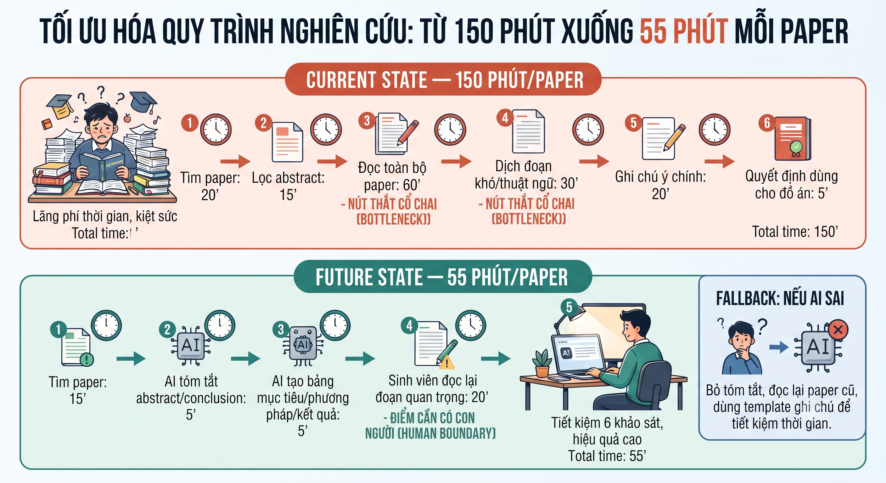
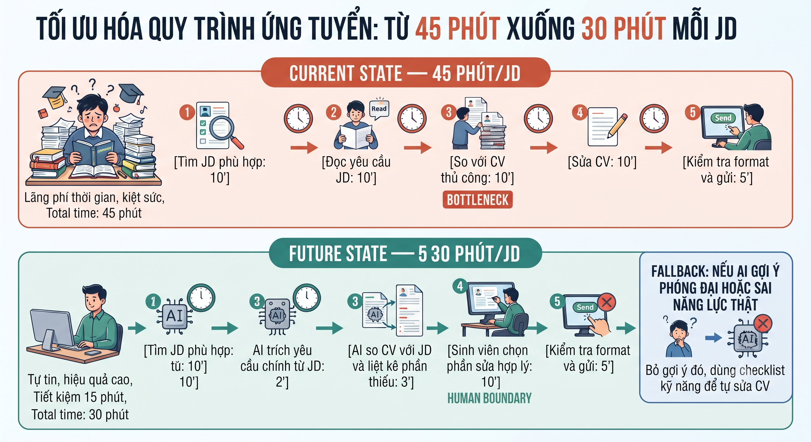

# 01 — Individual Problem Scan

> Điền theo Phase 1 + Phase 2 trong `01-worksheet.md`. Tự scan trước, dùng AI sau để phản biện. Không copy ví dụ Weekly Report.

## Thông tin cá nhân

- Họ và tên: Thân Tiến Đạt
- Mã học viên: 2A202603023
- Vai trò / bối cảnh (VD: sinh viên năm X, intern PM, ...): Sinh viên năm 4
- Công việc hằng tuần (3-5 gạch đầu dòng để soi problem): 
    + Làm đồ án tốt nghiệp: Tìm tài liệu, đề tài, viết báo cáo,...
    + Chuẩn bị thực tập: Sửa CV, tìm JD,...
    + Học tiếng anh
    + Học thêm kiến thức chuyên ngành

---

## Phase 1 — Scan 5+ problems (tối thiểu 5, khuyến khích 8-10)

**Cách điền:** mỗi dòng = việc gì + ai chịu + đo bằng gì. Cột `Dấu hiệu thật` bắt buộc có số: mất bao lâu (bấm giờ mấy lần), mấy lần/tuần, bao nhiêu người gặp, log/ticket/quote nào.

| # | Lăng kính (Lặp lại / Tốn thời gian / AI có thể tốt hơn / Pain từ người khác) | Problem quan sát được | Ai chịu ảnh hưởng? | Dấu hiệu thật (số + bằng chứng) |
|---|---|---|---|---|
| 1 | Tốn thời gian | Tìm kiếm tài liệu và đề tài đồ án phù hợp từ nhiều nguồn khác nhau | Sinh viên làm đồ án | Mỗi lần tìm kiếm tốn mất 2-4h, thường mở 5-10 tab và lọc thủ công tốn thời gian mà chưa tìm được đề tài phù hợp |
| 2 | Lặp lại | Theo dõi deadline môn học, đồ án, lịch họp nhóm bị rải rác từ nhiều môn khác nhau | Sinh viên năm cuối | Thường hay phải kiểm tra zalo, LMS,... 3-4 lần để tránh sai sót deadline |
| 3 | Pain từ người khác | Thành viên nhóm có thể quên hay hiểu sai task đã được phân công | Nhóm làm bài tập/đồ án | Mỗi tuần nhóm trường phải nhắc 2-3 lần trong nhóm chat, có task bị làm trễ hoặc sai yêu cầu |
| 4 | AI có thể tốt hơn | Đọc paper/tài liệu tiếng anh để rút ra ý chính phục vụ đồ án | Sinh viên làm đồ án | Một paper 8-12 trang mất 2-3 tiếng để đọc, dịch và ghi chú |
| 5 | Tốn thời gian | Viết báo cáo đồ án mất nhiều thời gian vì phải tổng hợp từ nhiều nguồn | Sinh viên làm đồ án | Mỗi lần viết, chỉnh hay lọc báo cáo mất 2-3 giờ, sửa đi sửa lại |
| 6 | Lặp lại | Format báo cáo, slide thuyết trình và tài liệu nộp bài theo yêu cầu giảng viên | Sinh viên trong các môn chuyên ngành | Mỗi bài nộp mất 30-60 phút để căn chỉnh font, mục lục, hình ảnh |
| 7 | Pain từ người khác | Nhóm khó thống nhất nội dung cuối cùng vì góp ý nằm rải rác trong nhiều đoạn chat, cuộc họp online mất tầm 30-45 phút | Nhóm làm đồ án | Sau mỗi cuộc họp hay chuẩn bị viết báo cáo phải tìm lại các góp ý để viết báo cáo hoàn chỉnh |
| 8 | AI có thể tốt hơn | Không biết CV hoặc hồ sơ thực tập còn thiếu gì so với JD tuyển dụng | Sinh viên năm cuối tìm thực tập/việc làm | Mỗi JD phải đọc 10-15 phút rồi tự so với CV, dễ bỏ sót keyword/kỹ năng |
| 9 | Tốn thời gian | Chuẩn bị phỏng vấn/bài test tuyển dụng bị rời rạc, không biết nên ôn phần nào trước | Sinh viên chuẩn bị đi thực tập/đi làm | Mỗi tuần dành 2-4 giờ ôn nhưng khó theo dõi tiến độ và lỗ hổng kiến thức |
| 10 | Lặp lại | Học từ vựng tiếng Anh nhưng hay quên vì không có lịch ôn lại theo mức độ nhớ/quên | Sinh viên năm 4 học tiếng Anh để thi chứng chỉ/phỏng vấn | Mỗi ngày học 15-20 từ nhưng sau 1 tuần quên khoảng một nửa, phải tra lại nhiều từ khi đọc tài liệu |

> Gợi ý tự soi: tuần trước mất nhiều thời gian nhất vào việc gì? Việc gì hay trì hoãn? Người khác hay hỏi lại câu gì? Workflow nào ai cũng biết là chậm?

**AI đã dùng ở Phase 1 (nếu có):**
- Prompt đã hỏi: Gợi ý 8-10 scan problems phù hợp với bối cảnh sinh viên năm 4, gồm các việc như làm đồ án, chuẩn bị thực tập, học tiếng Anh và học kiến thức chuyên ngành.
- Ý dùng được: Các problem về tìm tài liệu đồ án, theo dõi deadline, thành viên nhóm quên task, đọc paper tiếng Anh, viết báo cáo, kiểm tra CV với JD, chuẩn bị phỏng vấn và học từ vựng tiếng Anh.
- Ý bỏ vì không phải pain thật: Ý bỏ vì không phải pain thật, bỏ các ý quá rộng hoặc chưa đúng trải nghiệm cá nhân, ví dụ các vấn đề không gắn với lịch học, đồ án, thực tập hoặc tiếng Anh của bản thân.

**Self-check Phase 1:**
- [x] Đủ 5+ dòng, mỗi dòng có actor + số đo cụ thể
- [x] Dùng ít nhất 3/4 lăng kính
- [x] Không có dòng chung chung kiểu "mất nhiều thời gian"

---

## Phase 2 — Top 3 Problem Cards

### 2.1. Chọn top 3

Giữ bài nào: actor cụ thể, workflow vẽ được 3-7 bước, bottleneck ở 1 bước, impact đo được. Loại bài quá rộng.

| Rank | Problem (copy từ bảng scan) | Vì sao chọn (2-3 ý) | Điều còn chưa chắc |
|---|---|---|---|
| 1 | Đọc paper/tài liệu tiếng Anh để rút ra ý chính phục vụ đồ án | Actor rõ là sinh viên làm đồ án; workflow dễ vẽ từ tìm paper, đọc, dịch, ghi chú đến rút ý; bottleneck rõ ở bước đọc/dịch/ghi chú mất 2-3 tiếng | Chưa chắc AI có thể tóm tắt đủ chính xác nếu paper chuyên ngành khó hoặc có nhiều thuật ngữ |
| 2 | Không biết CV hoặc hồ sơ thực tập còn thiếu gì so với JD tuyển dụng | Gắn trực tiếp với sinh viên năm cuối chuẩn bị thực tập; workflow rõ; có metric 10-15 phút/JD và dễ đo số keyword/kỹ năng bị thiếu | Chưa chắc tiêu chí đánh giá CV đúng với từng công ty, vì mỗi JD và nhà tuyển dụng có ưu tiên khác nhau |
| 3 | Thành viên nhóm có thể quên hay hiểu sai task đã được phân công | Pain từ người khác rõ; có dấu hiệu nhóm trưởng phải nhắc 2-3 lần/tuần; workflow nhóm dễ vẽ và impact là trễ task hoặc làm sai yêu cầu | Chưa chắc vấn đề nằm ở công cụ, hay nằm ở cách nhóm phân công task chưa đủ rõ ngay từ đầu |

### 2.2. Problem Cards chi tiết (lặp lại cho cả 3 cards)

---

#### Problem Card #1 — Đọc paper/tài liệu tiếng Anh phục vụ đồ án

```text
Problem 1 câu:
Sinh viên làm đồ án mất 2-3 tiếng để đọc, dịch và ghi chú một paper 8-12 trang, khiến việc chọn tài liệu và rút ý chính phục vụ đồ án bị chậm.

Actor:
Sinh viên năm 4 đang làm đồ án tốt nghiệp, cần đọc paper/tài liệu tiếng Anh để hiểu hướng nghiên cứu và viết báo cáo.

Thời điểm / bối cảnh:
Khi bắt đầu tìm hướng đồ án, viết cơ sở lý thuyết hoặc cần đọc thêm tài liệu để giải thích phương pháp trong báo cáo.

Current workflow 3-7 bước:
1. Tìm paper/tài liệu liên quan trên Google Scholar, IEEE, arXiv hoặc các nguồn khác.
2. Mở nhiều tài liệu và đọc tiêu đề, abstract để lọc sơ bộ.
3. Đọc paper 8-12 trang bằng tiếng Anh.
4. Dịch các đoạn khó hoặc thuật ngữ chuyên ngành.
5. Ghi chú ý chính, phương pháp, dữ liệu, kết quả và điểm có thể dùng cho đồ án.
6. So sánh với đề tài của mình để quyết định có giữ tài liệu đó không.

Bottleneck:
Bước 3 và 4 là điểm nghẽn chính vì đọc paper tiếng Anh và dịch thuật ngữ chuyên ngành mất khoảng 2-3 tiếng/paper.

Impact:
Nếu phải đọc 5 paper cho một phần đồ án, tổng thời gian có thể mất 10-15 tiếng. Việc đọc chậm làm sinh viên khó chọn hướng nghiên cứu, chậm viết báo cáo và dễ bỏ sót tài liệu quan trọng.

Success metric:
Giảm thời gian xử lý một paper từ 2-3 tiếng xuống còn khoảng 45-60 phút, đồng thời vẫn ghi được ít nhất 5 ý chính: mục tiêu, phương pháp, dữ liệu, kết quả, điểm áp dụng cho đồ án.

Non-AI alternative:
Đọc abstract, conclusion trước; dùng template ghi chú paper cố định; chia nhóm mỗi người đọc một số paper rồi chia sẻ lại.

AI hypothesis:
AI có thể hỗ trợ tóm tắt paper, giải thích thuật ngữ, tạo bảng ghi chú theo template và gợi ý phần nào liên quan đến đồ án. Sinh viên vẫn phải đọc lại các đoạn quan trọng và kiểm tra nguồn.

Quick gut:
[ ] No AI / process fix
[ ] Rule
[x] Workflow
[ ] Agent
[ ] Chưa biết
```

**Draft workflow Card #1** (ASCII / Mermaid / ảnh đính kèm):

```text
CURRENT STATE — 150 phút/paper

[1 Tìm paper: 20']
→ [2 Lọc abstract: 15']
→ [3 Đọc toàn bộ paper: 60']  <-- bottleneck
→ [4 Dịch đoạn khó/thuật ngữ: 30']  <-- bottleneck
→ [5 Ghi chú ý chính: 20']
→ [6 Quyết định có dùng cho đồ án không: 5']

FUTURE STATE — 55 phút/paper

[1 Tìm paper: 15']
→ [2 AI tóm tắt abstract/conclusion: 5']
→ [3 AI tạo bảng mục tiêu/phương pháp/kết quả: 5']
→ [4 Sinh viên đọc lại đoạn quan trọng: 20']  <-- human boundary
→ [5 Sinh viên ghi chú và quyết định có dùng không: 10']

Fallback: nếu AI tóm tắt sai hoặc quá chung, sinh viên bỏ bản tóm tắt và đọc paper theo cách cũ, chỉ dùng template ghi chú để tiết kiệm thời gian.
```



---

#### Problem Card #2 — Kiểm tra CV với JD tuyển dụng

```text
Problem 1 câu:
Sinh viên năm cuối mất 10-15 phút cho mỗi JD để tự so CV với yêu cầu tuyển dụng, nhưng vẫn dễ bỏ sót keyword, kỹ năng hoặc kinh nghiệm cần bổ sung.

Actor:
Sinh viên năm 4 đang chuẩn bị thực tập hoặc tìm việc làm.

Thời điểm / bối cảnh:
Khi đọc JD thực tập/việc làm và muốn chỉnh CV trước khi ứng tuyển.

Current workflow 3-7 bước:
1. Tìm JD trên các trang tuyển dụng, group hoặc website công ty.
2. Đọc yêu cầu công việc và kỹ năng cần có.
3. Mở CV cá nhân để so sánh thủ công với JD.
4. Gạch ra keyword/kỹ năng đang thiếu hoặc viết chưa rõ.
5. Sửa CV cho phù hợp với JD.
6. Kiểm tra lại format và gửi ứng tuyển.

Bottleneck:
Bước 3 và 4 là điểm nghẽn vì phải tự đọc JD rồi so với CV, mất 10-15 phút/JD và dễ bỏ sót keyword quan trọng.

Impact:
Nếu ứng tuyển 10 JD, sinh viên mất khoảng 100-150 phút chỉ để đọc và so CV thủ công. CV không khớp JD có thể làm giảm khả năng được gọi phỏng vấn.

Success metric:
Giảm thời gian so CV với một JD từ 10-15 phút xuống còn 3-5 phút, đồng thời tạo được danh sách keyword/kỹ năng thiếu và 3-5 gợi ý sửa CV cụ thể.

Non-AI alternative:
Tạo checklist kỹ năng cố định theo vị trí muốn ứng tuyển; dùng một template CV chuẩn; nhờ bạn bè hoặc anh/chị có kinh nghiệm review CV.

AI hypothesis:
AI có thể đọc JD và CV, so khớp keyword/kỹ năng, chỉ ra phần còn thiếu và gợi ý cách sửa câu chữ. Sinh viên vẫn phải tự quyết định sửa gì để không phóng đại kinh nghiệm.

Quick gut:
[ ] No AI / process fix
[ ] Rule
[x] Workflow
[ ] Agent
[ ] Chưa biết
```

**Draft workflow Card #2:**

```text
CURRENT STATE — 45 phút/JD

[1 Tìm JD phù hợp: 10']
→ [2 Đọc yêu cầu JD: 10']
→ [3 So với CV thủ công: 10']  <-- bottleneck
→ [4 Sửa CV: 10']
→ [5 Kiểm tra format và gửi: 5']

FUTURE STATE — 30 phút/JD

[1 Tìm JD phù hợp: 10']
→ [2 AI trích yêu cầu chính từ JD: 2']
→ [3 AI so CV với JD và liệt kê phần thiếu: 3']
→ [4 Sinh viên chọn phần sửa hợp lý: 10']  <-- human boundary
→ [5 Kiểm tra format và gửi: 5']

Fallback: nếu AI gợi ý phóng đại hoặc không đúng năng lực thật, sinh viên bỏ gợi ý đó và chỉ dùng checklist kỹ năng để tự sửa CV.
```




---

#### Problem Card #3 — Thành viên nhóm quên hoặc hiểu sai task

```text
Problem 1 câu:
Trong nhóm làm bài tập/đồ án, thành viên có thể quên hoặc hiểu sai task đã được phân công, khiến nhóm trưởng phải nhắc 2-3 lần/tuần và có task bị trễ hoặc sai yêu cầu.

Actor:
Nhóm sinh viên làm bài tập lớn hoặc đồ án, đặc biệt là nhóm trưởng và các thành viên được phân công task.

Thời điểm / bối cảnh:
Sau các buổi họp nhóm, khi nhóm chia việc qua chat và mỗi người tự theo dõi phần việc của mình.

Current workflow 3-7 bước:
1. Nhóm họp online/offline để thống nhất việc cần làm.
2. Nhóm trưởng phân công task trong nhóm chat.
3. Thành viên đọc tin nhắn và tự nhớ phần việc của mình.
4. Trong tuần, nhóm trưởng nhắc lại các task gần deadline.
5. Thành viên gửi kết quả hoặc hỏi lại nếu chưa hiểu rõ.
6. Nhóm trưởng kiểm tra và yêu cầu sửa nếu làm sai yêu cầu.

Bottleneck:
Bước 3 và 4 là điểm nghẽn vì task nằm trong nhiều đoạn chat, không có checklist rõ ràng nên thành viên dễ quên hoặc hiểu khác ý ban đầu.

Impact:
Nhóm trưởng phải nhắc 2-3 lần/tuần, mất thêm thời gian theo dõi. Task bị trễ hoặc sai yêu cầu có thể làm cả nhóm phải sửa gấp trước deadline.

Success metric:
Giảm số lần nhóm trưởng phải nhắc từ 2-3 lần/tuần xuống còn tối đa 1 lần/tuần, và giảm số task bị trễ/sai yêu cầu trong mỗi tuần.

Non-AI alternative:
Dùng Google Sheet, Trello, Notion hoặc checklist cố định sau mỗi buổi họp; mỗi task phải có owner, deadline và tiêu chí hoàn thành.

AI hypothesis:
AI có thể hỗ trợ tóm tắt nội dung họp/chat thành danh sách task có owner, deadline, tiêu chí hoàn thành và nhắc lại phần chưa rõ. Tuy nhiên nhóm vẫn phải xác nhận lại danh sách task cuối cùng.

Quick gut:
[ ] No AI / process fix
[ ] Rule
[x] Workflow
[ ] Agent
[ ] Chưa biết
```

**Draft workflow Card #3:**

```text
CURRENT STATE — 90 phút/tuần tổng workflow theo dõi và sửa task

[1 Họp nhóm: 30']
→ [2 Phân công trong chat: 10']
→ [3 Thành viên tự nhớ task: không rõ]
→ [4 Nhóm trưởng nhắc 2-3 lần/tuần: 20']  <-- bottleneck
→ [5 Thành viên nộp task]
→ [6 Sửa nếu task sai yêu cầu: 30']

FUTURE STATE — 55 phút/tuần tổng workflow, trong đó theo dõi task sau họp khoảng 25 phút

[1 Họp nhóm: 30']
→ [2 AI/Template tóm tắt task từ notes/chat: 5']
→ [3 Nhóm trưởng kiểm tra owner, deadline, tiêu chí hoàn thành: 10']  <-- human boundary
→ [4 Gửi checklist task cho cả nhóm: 5']
→ [5 Thành viên cập nhật trạng thái trên checklist: 5']

Fallback: nếu AI tóm tắt sai task hoặc gán nhầm owner, nhóm trưởng sửa lại thủ công và dùng checklist cố định thay vì phụ thuộc vào AI.
```


---

### 2.3. Card muốn pitch nhất (chuẩn bị 2 phút)

**Card tôi muốn pitch nhất:**

```text
Problem Card #1 — Đọc paper/tài liệu tiếng Anh phục vụ đồ án.
```

**Vì sao (2-3 câu: workflow gì, số đo gì, impact gì):**

```text
Tôi muốn pitch card này vì đây là việc gắn trực tiếp với sinh viên năm 4 làm đồ án và có workflow khá rõ: tìm paper, lọc, đọc, dịch, ghi chú và quyết định có dùng cho đồ án không. Bottleneck hiện tại là đọc/dịch paper 8-12 trang mất khoảng 2-3 tiếng/paper. Nếu cải thiện được bước này, sinh viên có thể đọc nhiều tài liệu hơn và viết phần cơ sở lý thuyết tốt hơn.
```

**Câu hỏi tôi muốn nhóm challenge (1-2 câu hỏi đúng chỗ yếu):**

```text
AI tóm tắt paper có đủ tin cậy không, hay vẫn bắt buộc sinh viên đọc lại phần phương pháp và kết quả? Metric "giảm từ 2-3 tiếng xuống 45-60 phút" có đo được trong một bài pilot nhỏ không?
```

**AI phản biện Card (nếu có):**
- Điểm yếu AI chỉ ra: Metric về chất lượng tóm tắt chưa đủ rõ; cần có human boundary vì AI có thể hiểu sai thuật ngữ hoặc bỏ sót chi tiết quan trọng trong paper.
- Tôi sửa gì: Thêm yêu cầu sinh viên đọc lại các đoạn quan trọng, thêm fallback nếu AI tóm tắt sai, và đo output bằng 5 ý chính cần ghi được từ mỗi paper.

### Self-check nộp phần 01
- [x] Có 5+ problems + top 3 Cards đủ field
- [x] Mỗi Card có workflow trước/sau + bottleneck + metric + fallback
- [x] Đã chọn 1 card pitch + câu hỏi challenge
